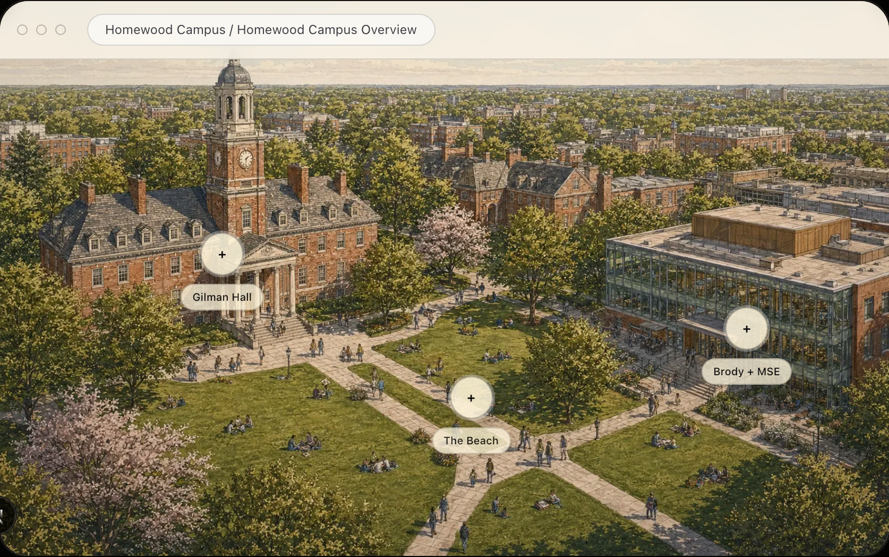

<p align="center">
  
</p>

<h1 align="center">JHU Homewood Campus Visual Archive</h1>

<p align="center">
  <strong>An illustrated browser for Johns Hopkins University's Homewood campus.</strong>
</p>

<p align="center">
  Architectural references · campus routes · visual studies · scene-based exploration
</p>

<p align="center">
  <a href="https://github.com/reynold-hu/JHU-Campus-Visual-Art">Repository</a> ·
  <a href="http://localhost:3300">Local preview</a> ·
  <a href="https://www.jhu.edu/">JHU context</a>
</p>

<p align="center">
  
</p>

## The idea

Campus information is usually organized as a map, a facilities list, or a photo gallery. This project treats Homewood as a visual archive instead: a connected set of scenes that can be explored through buildings, paths, landmarks, and small campus-life details.

Start with the overview, open a hotspot, move into Gilman Hall, Brody Learning Commons, The Beach, or a smaller architectural study, then return through the visual breadcrumb.

## What it contains

- **Campus overview** — a broad illustrated view with clickable regions.
- **Architectural studies** — Gilman Hall, the clock tower, entrances, brick facades, and material details.
- **Learning spaces** — Brody Learning Commons, quiet reading, group rooms, and circulation layers.
- **Campus rhythm** — The Beach, diagonal paths, blankets, reading, and everyday movement.
- **Scene hierarchy** — every visual detail remains connected to its parent place.
- **Soft transitions** — scene changes, hotspot reveals, breadcrumb navigation, and a warm paper interface.

## Quick start

```bash
git clone git@github.com:reynold-hu/JHU-Campus-Visual-Art.git
cd JHU-Campus-Visual-Art
npm install
npm run dev
```

Open <http://localhost:3000>.

To create a production build:

```bash
npm run build
npm run start
```

## How it works

```text
Campus overview
      ↓
Clickable hotspot
      ↓
Focused visual scene
      ↓
Architectural / campus-life detail
      ↓
Breadcrumb back to context
```

The scene graph lives in `components/HomewoodAtlas.tsx`. Each scene defines its image, description, note, parent scene, and hotspots. Adding a new building or detail means adding a new scene node and connecting it to the existing visual hierarchy.

## Project structure

```text
app/
  page.tsx                 # standalone page and metadata
  globals.css              # warm visual system
components/
  HomewoodAtlas.tsx        # scene graph and browser interaction
public/
  homewood/                # generated campus scenes
  covers/                  # repository preview artwork
  jhu-logo.png             # README context mark
```

## Image provenance

The campus scenes in `public/homewood/` and the preview artwork in `public/covers/` were generated with GPT for this personal visual study. They are illustrative references and do not represent official Johns Hopkins University photography, architectural records, or an official university asset library.

The Johns Hopkins University name and logo belong to Johns Hopkins University. The logo is used for identification and context only. This project does not claim university endorsement or affiliation.

Full provenance notes are in [ASSETS.md](./ASSETS.md).

## Copyright and usage

Copyright © 2026 Reynold Hu. All rights reserved.

This repository is published for review and controlled collaboration. No open-source license is granted. The source code, generated images, visual compositions, copy, and interaction design may not be independently copied, republished, relicensed, packaged, or used commercially without written permission.

GitHub forks are the approved collaboration path. A fork must preserve this README, the copyright notice, asset provenance, and attribution. A fork does not grant permission to distribute an unrelated standalone copy or remove the rights notices.

See [LICENSE](./LICENSE).
